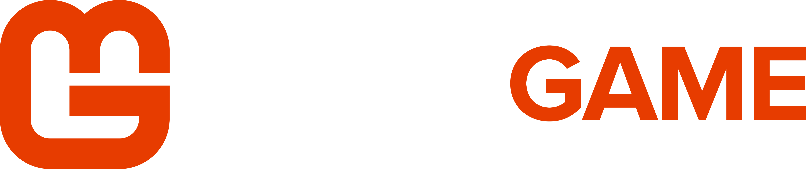
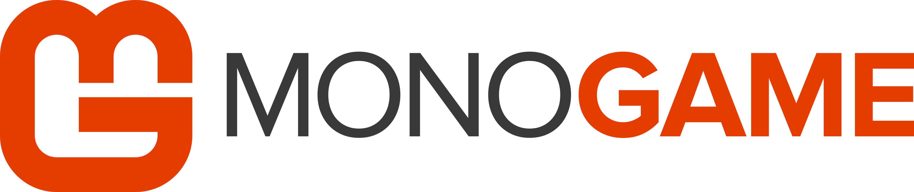
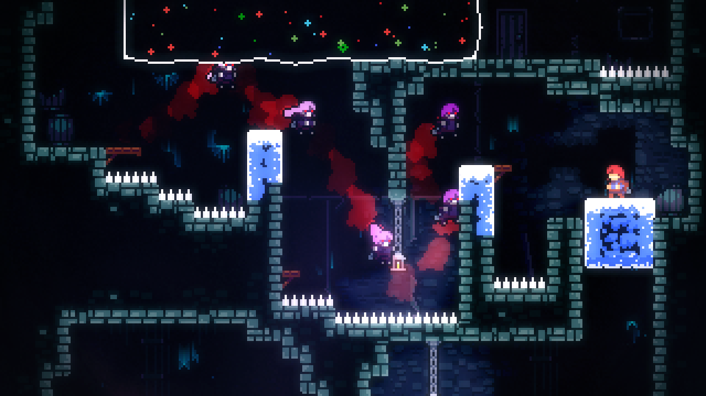
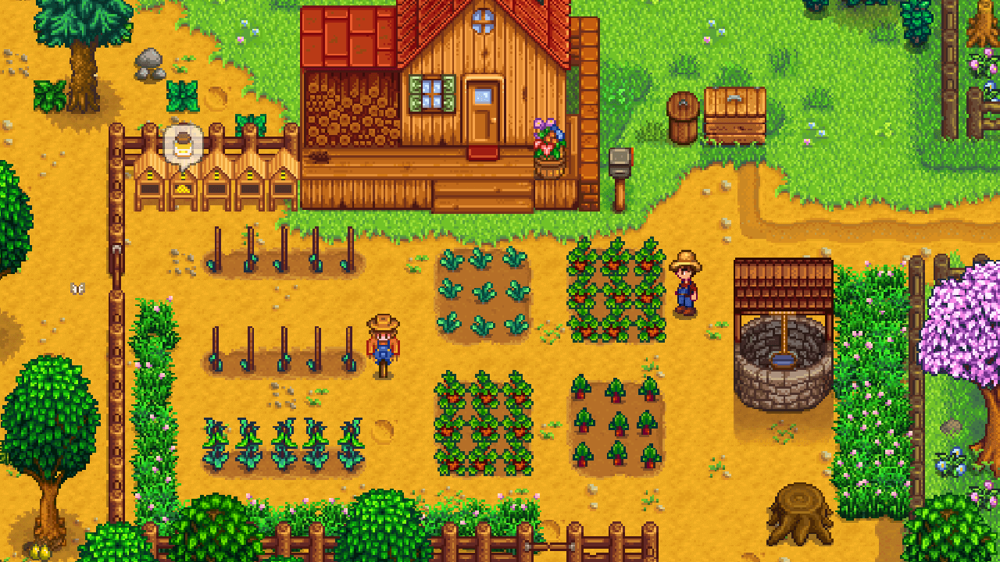
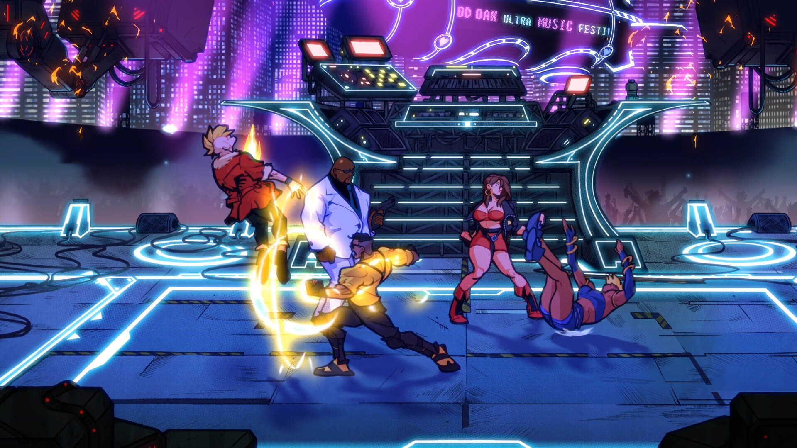

This article is to give you a brief introduction to MonoGame and to help you determine if it is the right fit for your game development project. We'll introduce the core concepts of what the MonoGame framework is and what you should expect to be able to achieve by using it.

## What is MonoGame
MonoGame is an open-source implementation of the [Microsoft XNA 4.0 Framework](https://en.wikipedia.org/wiki/Microsoft_XNA). XNA was originally developed by Microsoft to facilitate game development for Windows and Xbox 360. An open-source project named XNA Touch was created by José Antonio Leal de Farias with the intention of porting XNA games to mobile devices. XNA Touch was later renamed MonoGame and expanded over time to include support for Mac, Linux, and OpenGL on Windows, making it truly cross-platform.

In 2013, Microsoft discontinued development of XNA while MonoGame continued to be developed and started seeing its first titles coming to the PS4 console. Today, the MonoGame project is actively developed and supported by a vibrant community of contributors and maintainers. Its longevity and evolution make it a robust choice for developers looking for a versatile and community-backed framework.

## What Can MonoGame Do
MonoGame, much like XNA, is a "bring your own tools" kind of framework, providing you with the building blocks to build your own engine and tools. It is a code-first approach to game development, meaning there is no editor or interface provided. Instead, developers are free to use existing tools, such as Tiled or LDtk for level design, or create their own tools. This empowers developers with greater flexibility and freedom regarding what systems and features are included in their game.

MonoGame can be used to create 2D or 3D games and applications that run cross-platform on desktop, mobile, and consoles. This flexibility allows developers to target multiple platforms with a single codebase, reducing the need for extensive rewrites and porting.

Some examples of games created with MonOGame include [Celeste](https://store.steampowered.com/app/504230/Celeste/), [Stardew Valley](https://store.steampowered.com/app/413150/Stardew_Valley/), and [Streets of Rage 4](https://store.steampowered.com/app/985890/Streets_of_Rage_4/)

 

 

 

## Key Features and Capabilities
- **Cross-Platform Development**: Write once, run anywhere. MonoGame supports Windows, macOS, Linux, iOS, Android, and various consoles.
- **2D and 3D Rendering**: Support for both 2D and 3D graphics, enabling the creation of a wide range of games and visual experiences.
- **Sound Effect and Music Playback**: Incorporate audio effects and music to enhance the gaming experience using the built-in sound API.
- **Keyboard, Mouse, Touch, and Controller Inputs**: Comprehensive input handling for various input devices, ensuring a seamless user experience across different platforms.
- **Content Building and Optimization**: Tools for efficiently building and optimizing game content to ensure smooth performance.
- **Math Library Optimized for Games**: A math library specifically optimized for game development, providing essential mathematical functions and operations.

> [!NOTE]
> Developing games for consoles requires a more advanced skill set for programming or another developer or studio that can port the game for you.  
> 
> Console development is also unique in that the MonoGame Foundation can only provide the console specific portions once developers have been approved by that console manufacturer.  This is due to licensing terms and agreements imposed by console manufacturers.

## Programming Languages
C# is the language MonoGame is built with, and is the primary language used when creating games, in documentation, samples, and community discussions.  However, it is also a .NET library, meaning that you can use any compatible .NET language to develop games, such as Visual Basic or F#.  If you do choose a an alternative .NET language, please keep in mind that community help and support may be limited.

Developers should have a foundational level understanding of C# and be comfortable with concepts such as classes and objects.  If you are entirely new to C#, or programming in general, we recommend following the official [Learn C#](https://dotnet.microsoft.com/en-us/learn/csharp) tutorials provided by Microsoft. These tutorials are free and will teach you programming concepts as well as the C# language.

## Getting Started
If the above information sounds like a good fit for your project, continue to the [Getting Started](./getting_started/index.md) page to setup your development environment, create your first project, and go over the core concepts for developing a game with MonoGame.

## How to Use These Documents
Ont he left side of the screen, you will find the documentation navbar.  On mobile devices, this can be access by clicking the hamburger menu at the top on the left.  On the right side of the screen, you will see a table of contents that makes it easier to navigate between sections of the current document being viewed.

## Join our Community
If you have any questions related to MonoGame, you are welcome to join one of our community hubs and ask questions

- [GitHub Discussions](https://github.com/MonoGame/MonoGame/discussions)
- [Discord](https://discord.gg/monogame)
- [Reddit](https://www.reddit.com/r/monogame/)
- [Facebook](https://www.facebook.com/monogamecommunity)
- [Twitter](https://twitter.com/MonoGameTeam)
- [YouTube](https://www.youtube.com/MonoGame)

## We Need Your Help!

MonoGame is an open-source project maintained by its community. Great open source projects require high-quality documentation. This is a call for volunteers to continue to help us make the MonoGame documentation truly great. If you can create tutorials, feature guides, code snippets, reference docs, video walkthroughs, or make any improvement to the current documentation, we could use your help!

Check out the [README on GitHub](https://github.com/MonoGame/MonoGame/blob/develop/README.md) or [talk with us on the community site](http://community.monogame.net/t/lets-improve-the-monogame-documentation/916) to learn how to help! For a quick start, you can jump on this [list of documentation tasks](https://github.com/MonoGame/MonoGame/projects/4).
